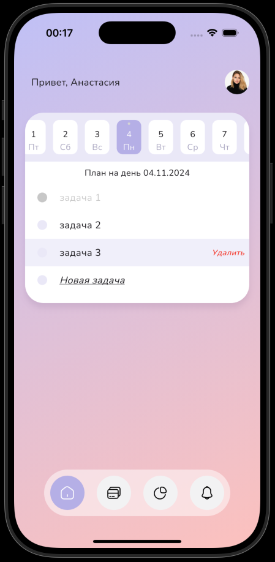

## Задание

- [ТЗ](https://docs.google.com/document/d/13lOHtIi1ilRMXs6qc8Gl0oRrPM03D0Hiuyc3y0CL-hs/edit?tab=t.0#heading=h.e0lwp1j3jtso)

- [Макет](https://www.figma.com/design/xzlbsdNK7ezZHT69Urw39C/Untitled?node-id=0-1&node-type=canvas&t=l7FoR63gs2m11SdV-0)

## Релиз

- [APK-файл приложения](https://drive.google.com/file/d/1NbRmr8AiBwMfi1xZjp--9yvpCPaPT1-F/view?usp=sharing)

## Инструкция по сборке и запуску

1. Для базовой настройки окружения воспользуйтесь [официальной документацией](https://docs.flutter.dev/get-started/install)

2. На момент создания проекта использовались:
    - Flutter 3.24.4
    - Xcode 16.1
    - Android Studio 2024.2

3. Склонируйте проект и перейдите в его директорию

4. Выполните `flutter pub get` для загрузки зависимостей

5. Для запуска интеграционного теста

`flutter driver --target=test/test_app.dart --driver=test/integration_test.dart`

6. Для сборки apk-файла выполните `flutter build apk`